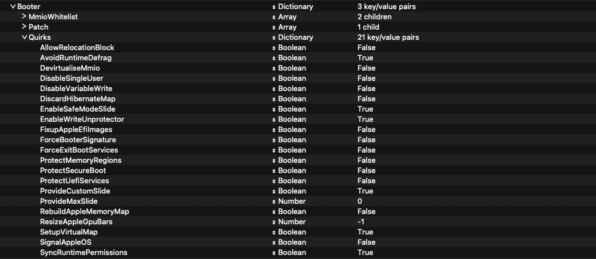

É lei todo notebook que eu compro tentar fazer um Hackintosh, no ThinkPad L14 não poderia ter sido diferente. Felizmente, até que muitas coisas estão funcionando no macOS Sequoia.

Os hardwares dos ThinkPads variam absurdamente dependendo do modelo, por isso irei reforçar que o meu é um ThinkPad L14 Gen 3 com as seguintes especificações:
- CPU: AMD Ryzen 5 PRO 5675U
- RAM: 16GB DDR4 3200MHz (2x8)
- SSD: 512GB NVMe UMIS
- GPU: AMD Radeon RX Vega 7
- Wi-Fi/Bluetooth: AMD RZ616
- Ethernet: Algum Realtek RTL
- Som: Algum Realtek ALC

Status atual:
- CPU: suportado
- RAM: suportado
- SSD: suportado
- GPU: suportado com a ajuda do [NootedRed](https://github.com/ChefKissInc/NootedRed), mas há [problemas](https://github.com/ChefKissInc/NootedRed/issues/158)
- Wi-Fi/Bluetooth: não suportado
- Ethernet: suportado
- Som: suportado

Outras coisas:
- Brilho: funciona
- HDMI: funciona
- Bateria: funciona
- USB: funciona
- Thunderbolt: não testei
- Teclado/TrackPoint: funciona
- Touchpad: não funciona (mas talvez haja correção)
- iCloud: funciona

Algumas descobertas:
- Tive problemas de desempenho com o kext YogaSMC, que habilita o acesso a alguns sensores, dentre outras coisas
- Usar "Linux S3" na opção "Sleep State" da BIOS resolve o problema em que ele reinicia ao desligar
- Curiosamente, o VoodooHDA funcionou melhor que o AppleALC no áudio
- O sistema só inicializa com essa parte do OpenCore configurado dessa forma:

Um agradecimento a todos os desenvolvedores que fazem isso ser possível, o trabalho feito é realmente impressionante.
