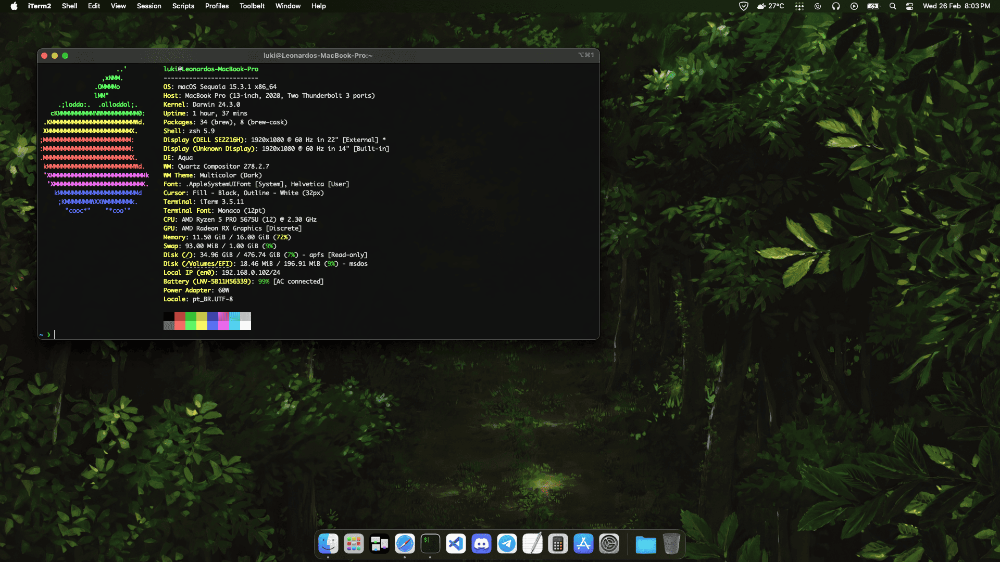

It's a rule of mine to try making a Hackintosh on every laptop I buy, and the ThinkPad L14 was no exception. Fortunately, many things are working on macOS Sequoia.

ThinkPad hardware varies drastically depending on the model, so I'll emphasize that mine is a ThinkPad L14 Gen 3 with the following specifications:
- CPU: AMD Ryzen 5 PRO 5675U
- RAM: 16GB DDR4 3200MHz (2x8)
- SSD: 512GB NVMe UMIS
- GPU: AMD Radeon RX Vega 7
- Wi-Fi/Bluetooth: AMD RZ616
- Ethernet: Some Realtek RTL
- Sound: Some Realtek ALC

Current status:
- CPU: supported
- RAM: supported
- SSD: supported
- GPU: supported with help from [NootedRed](https://github.com/ChefKissInc/NootedRed), but there are [issues](https://github.com/ChefKissInc/NootedRed/issues/158)
- Wi-Fi/Bluetooth: not supported
- Ethernet: supported
- Sound: supported

Other things:
- Brightness: works
- HDMI: works
- Battery: works
- USB: works
- Thunderbolt: not tested
- Keyboard/TrackPoint: works
- Touchpad: doesn't work (but there might be a fix)
- iCloud: works

Some discoveries:
- I had performance issues with the YogaSMC kext, which enables access to some sensors, among other things
- Using "Linux S3" in the "Sleep State" option in BIOS solves the problem where it restarts when shutting down
- Curiously, VoodooHDA worked better than AppleALC for audio
- The system only boots with this part of OpenCore configured this way:

A thank you to all the developers who make this possible, the work done is truly impressive.
